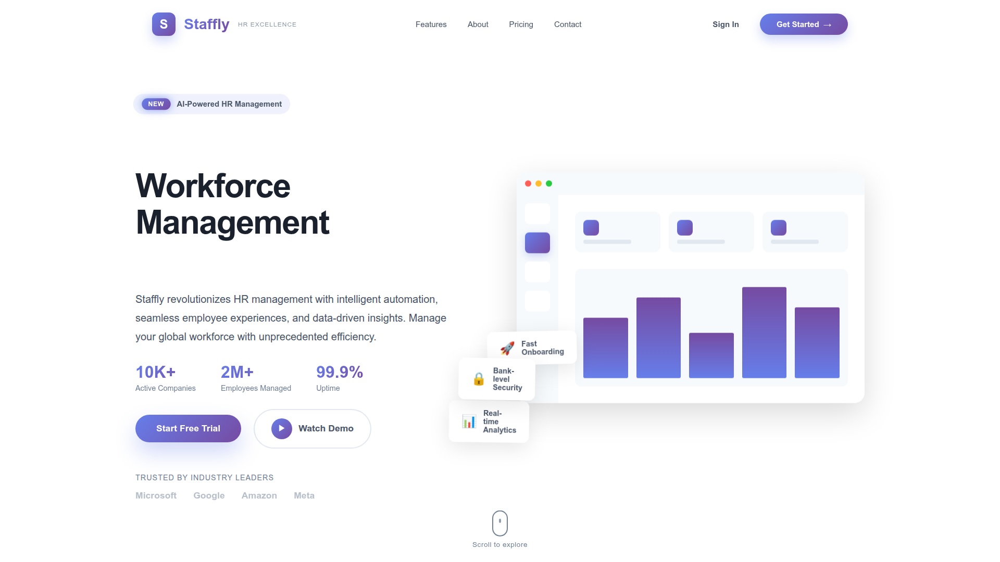

# Uma.dev - Portfolio Website

A modern, full-stack portfolio website built with React, Node.js, and PostgreSQL.



## 🚀 Tech Stack

### Frontend
- React 18 with TypeScript
- Tailwind CSS & Framer Motion
- Vite for fast development
- Wouter for routing

### Backend
- Node.js & Express
- PostgreSQL with Drizzle ORM
- RESTful API architecture

### Database
- PostgreSQL (Supabase)

## 🛠️ Getting Started

### Prerequisites
- Node.js 18+
- PostgreSQL database (or Supabase account)

### Installation

```bash
# Clone the repository
git clone https://github.com/umasharma-cell/Uma.dev.git
cd Uma.dev

# Install dependencies
npm install

# Set up environment variables
cp .env.example .env
# Add your DATABASE_URL to .env

# Push database schema
npx drizzle-kit push

# Start development server
npm run dev
```

### Environment Variables

Create a `.env` file with:
```
DATABASE_URL=your_postgresql_connection_string
GMAIL_APP_PASSWORD=your_gmail_app_password (optional, for contact form)
```

## 📁 Project Structure

```
├── client/           # React frontend
│   ├── src/
│   │   ├── components/
│   │   ├── pages/
│   │   ├── hooks/
│   │   └── lib/
├── server/           # Express backend
│   ├── index.ts
│   ├── routes.ts
│   └── storage.ts
├── shared/           # Shared types & schemas
└── attached_assets/  # Images & resume
```

## 🌐 Deployment

This is a full-stack application. Deploy options:

### Option 1: Railway / Render (Recommended)
- Supports Node.js + PostgreSQL
- Single deployment for both frontend & backend
- Add DATABASE_URL in environment variables

### Option 2: Vercel + External Database
- Frontend deploys automatically
- Use Vercel Serverless Functions for API
- Connect to Supabase for database

## 📧 Contact

- **Email:** work.uma26@gmail.com
- **GitHub:** [umasharma-cell](https://github.com/umasharma-cell)
- **Portfolio:** [uma.dev](https://uma.dev)

## 📄 License

MIT License
